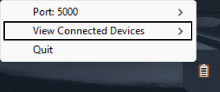
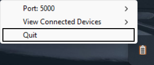

# Common Clipboard

Welcome to Common Clipboard, an application written with Python to create a shared clipboard experience between iOS and
Windows devices connected to a common network. This shared clipboard allows for cleaner and faster data transfer between
the two platforms, where data copied on one device can almost instantly be pasted in the other. This project is intended
to be similar to Apple's [Universal Clipboard](https://support.apple.com/en-us/HT209460) that creates a shared clipboard
between Apple products. Common Clipboard interfaces directly with the native clipboard of the device it is running on
and all the data transfer happens in the background, meaning the only commands you need to know are Copy and Paste!

> **Note:** Currently only works for the transfer of unicode text and images and may have a short (1-3 second) delay
> depending on internet speed and size of copied data

## Usage

> **Note:** Common Clipboard requires at least one Windows device on the local network to function (more information
> below)

### iOS/iPadOS

1. Ensure the Common Clipboard shortcut is running on the same port as the Windows server
    * The port number can be changed in the code of the shortcut

2. Run the Common Clipboard shortcut on all desired iOS/iPadOS devices on the local network
    * The shortcut will automatically connect to the network and begin sharing clipboard data
    * You may be repeatedly asked for permission to send data after copying. This is a security feature by Apple and
    * cannot be turned off. Simply click "Always Allow" when prompted

3. Close the Shortcuts app (press the home button or swipe up)
    * **DO NOT** quit the app by swiping it away from the menu. This will stop the shortcut

4. To quit the shortcut, either quit the Shortcuts app, or enter the Shortcuts app and click the loading wheel in the
   top right corner of the shortcut

### Windows

1. Launch the Common Clipboard application on all desired Windows devices on the local network
    * If a server is running on the local network, the application will automatically connect and begin sharing
      clipboard data

2. Run the server on only **ONE** device on the local network from the system tray
    * The server **MUST** be running in order for clipboard data transfer to occur between devices

   

3. Edit the port number from the system tray to match the port number of the server (if necessary). The port number can
   also be changed while the server is running
    * Changing the port number is likely only necessary if multiple users are using Common Clipboard on the same network

   

4. On the device running the server, the names and local IPv4 addresses of all connected devices can be viewed from the
   system tray

   

5. To quit the Common Clipboard application, use the "Quit" option in the system tray

   

## Installation

### Windows

Download the latest version of the Common Clipboard and Common Clipboard Server applications
from [releases](https://github.com/cmdvmd/common-clipboard/releases)

### iOS

Download the latest version of the Common Clipboard shortcut from [RoutineHub](https://routinehub.co/shortcut/16222/) as
well as the [Scriptable app](https://apps.apple.com/app/id1405459188).
